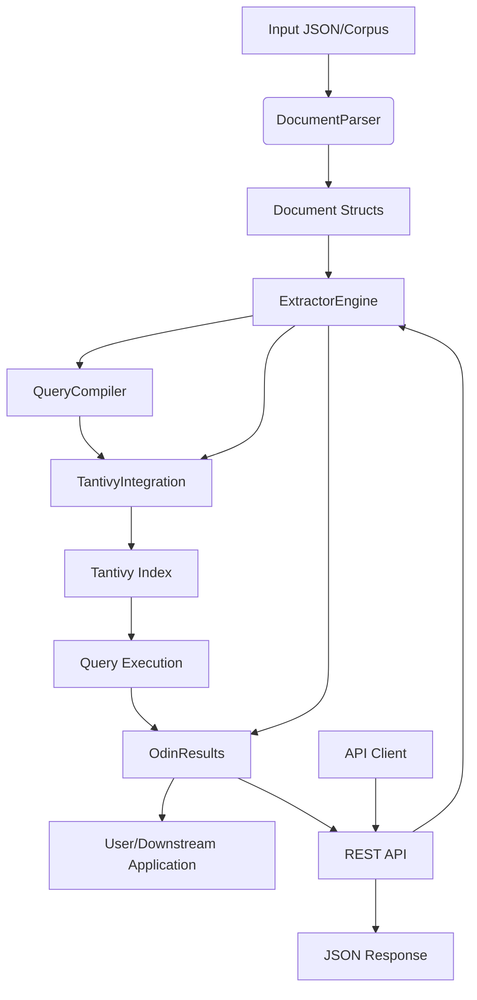

<p align="center">
  
</p>

# RustIE: Information Extraction System

> ⚠️ **Disclaimer**  
> RustIE is currently in **active development**. It is **not ready for production use** and APIs may change without notice.


RustIE is a modular information extraction (IE) system built on top of the Tantivy search engine. It is designed for efficient linguistic search and pattern-based extraction over annotated text corpora. Inspired by Odinson, RustIE supports efficient pattern-based querying over linguistically annotated text corpora.

## Features

### Query Language
- **Token Constraints**: Match tokens by field values (`[word=John]`), regex (`[word=/^[A-Z].*/]`), or wildcards (`[]`)
- **Logical Operators**: Combine constraints with OR (`|`) and AND (`&`) at the token level
- **Negation**: Exclude matches with `!=` operator (`[word!=the]`)
- **Adjacent Patterns**: Match sequences of tokens (`[word=the] [word=cat]`)
- **Quantifiers**: Greedy (`*`, `+`, `?`) and lazy (`*?`, `+?`) repetition
- **Range Quantifiers**: Match specific counts (`[]{2,5}`)
- **Graph Traversals**: Navigate dependency relations (`>nsubj`, `<dobj`, `>>`, `<<`)
- **Regex Labels**: Match traversal labels with regex (`>/nsubj|dobj/`)
- **Named Captures**: Extract matched spans (`(?<subject> [word=John])`)
- **Assertions**: Lookahead and lookbehind (`(?= ...)`, `(?! ...)`, `(?<= ...)`, `(?<! ...)`)

### Search Engine
- Built on **Tantivy** for high-performance full-text search
- **Custom scorers** for linguistic pattern matching
- **Dependency graph** traversal with cycle detection
- **Configurable schema** via YAML

### API
- RESTful HTTP API for querying
- JSON input/output
- Health checks and statistics endpoints

## Quick Start

### Running the API Server

```bash
# Start the API server
cargo run --bin api_server

# With custom configuration
cargo run --bin api_server -- --host 0.0.0.0 --port 8080 --index-path ./index
```

### Querying Documents

```bash
# Health check
curl http://localhost:8080/api/v1/health

# Query documents
curl -X POST http://localhost:8080/api/v1/query \
  -H "Content-Type: application/json" \
  -d '{"query": "[word=John] >nsubj [pos=VBZ]", "limit": 10}'

# Simple query
curl "http://localhost:8080/api/v1/query/[word=John]%20%3Ensubj%20[pos=VBZ]"
```

For detailed API documentation, see [API_README.md](API_README.md).

## Architecture Overview

### Main Modules

- **data**: Handles data ingestion and structuring. Parses JSON into Rust structs and provides accessors for fields and dependencies.
- **compiler**: Compiles extraction patterns into query objects. Converts user queries into Tantivy-compatible queries.
- **digraph**: Handles dependency graphs and graph traversal for linguistic structures.
- **engine**: Orchestrates the extraction process. Main entry point for indexing, querying, and extraction.
- **tantivy_integration**: Bridges RustIE's data model and query logic with Tantivy's search engine. Implements advanced search logic.
- **results**: Structures and formats extraction results.
- **types**: Shared types and utilities used throughout the system.
- **api**: REST API for querying documents using Odinson patterns.
- **bin**: Example binaries for parsing data and running queries.

---

## How the Modules Connect



### Step-by-step:
1. **Data Ingestion:**  
   `DocumentParser` (in `data`) reads and parses annotated JSON into `Document` structs.
2. **Indexing:**  
   `ExtractorEngine` (in `engine`) converts documents into Tantivy documents and indexes them.
3. **Pattern Compilation:**  
   User queries/patterns are parsed and compiled by `QueryCompiler` (in `compiler`) into query objects.
4. **Query Execution:**  
   `ExtractorEngine` uses `tantivy_integration` to run compiled queries against the Tantivy index. Custom queries (e.g., for dependency graphs) are handled by specialized modules in `tantivy_integration` and `digraph`.
5. **Result Formatting:**  
   Matches are collected and formatted as `OdinResults` (in `results`), which are returned to the user or downstream applications.
6. **API Access:**  
   The REST API (in `api`) provides HTTP endpoints for querying documents and retrieving results.

---

## Example: End-to-End Flow

1. **User provides a JSON file** with annotated sentences and dependencies.
2. **`DocumentParser`** parses the file into Rust structs.
3. **`ExtractorEngine`** indexes the data using Tantivy.
4. **User submits a pattern/query** (e.g., `[word=John] [pos=NNP]`) via API or direct call.
5. **`QueryCompiler`** compiles the pattern into a Tantivy query.
6. **`ExtractorEngine`** executes the query, using custom logic for linguistic structures.
7. **Results** are returned as structured matches (`OdinResults`) or JSON via API.

---

## Query Language

RustIE uses an Odinson-inspired query language for pattern matching over linguistically annotated text.

### Basic Token Constraints

| Syntax | Description | Example |
|--------|-------------|---------|
| `[field=value]` | Match token where field equals value | `[word=John]` |
| `[field!=value]` | Negation - field does NOT equal value | `[word!=the]` |
| `[field=/regex/]` | Match field against regex pattern | `[word=/^[A-Z].*/]` |
| `[]` | Wildcard - matches any token | `[]` |
| `[*]` | Explicit wildcard | `[*]` |

### Combining Constraints (Token-Level)

| Syntax | Description | Example |
|--------|-------------|---------|
| `[a \| b]` | OR - match a OR b | `[word=cat \| word=dog]` |
| `[a & b]` | AND - match a AND b | `[word=cat & pos=/N.*/]` |

### Adjacent Token Patterns (Sequences)

| Syntax | Description | Example |
|--------|-------------|---------|
| `[a] [b]` | Adjacent tokens | `[word=the] [word=cat]` |
| `[a] [b] [c]` | Three adjacent tokens | `[word=the] [pos=JJ] [word=cat]` |
| `[a] [] [b]` | Tokens with any token between | `[word=the] [] [word=cat]` |

### Quantifiers (Repetition)

| Syntax | Description | Example |
|--------|-------------|---------|
| `[]*` | Zero or more (greedy) | `[pos=JJ]*` |
| `[]+` | One or more (greedy) | `[pos=JJ]+` |
| `[]?` | Zero or one (optional) | `[pos=JJ]?` |
| `[]{n,m}` | Between n and m times | `[]{2,5}` |
| `[]*?` | Zero or more (lazy) | `[]*?` |
| `[]+?` | One or more (lazy) | `[]+?` |

### Graph Traversals (Dependency Relations)

| Syntax | Description | Example |
|--------|-------------|---------|
| `>label` | Outgoing edge with label | `[word=eats] >nsubj [word=John]` |
| `<label` | Incoming edge with label | `[word=John] <nsubj [word=eats]` |
| `>>` | Any outgoing edge | `[word=eats] >> []` |
| `<<` | Any incoming edge | `[word=pizza] << []` |
| `>/regex/` | Outgoing edge matching regex | `[word=eats] >/nsubj\|dobj/ []` |

### Named Captures

| Syntax | Description | Example |
|--------|-------------|---------|
| `(?<name> pattern)` | Capture pattern as name | `(?<subject> [word=John])` |

### Assertions (Lookahead/Lookbehind)

| Syntax | Description | Example |
|--------|-------------|---------|
| `(?= pattern)` | Positive lookahead | `(?= [word=test])` |
| `(?! pattern)` | Negative lookahead | `(?! [word=test])` |
| `(?<= pattern)` | Positive lookbehind | `(?<= [word=test])` |
| `(?<! pattern)` | Negative lookbehind | `(?<! [word=test])` |

### Regex Patterns

RustIE supports standard Rust/Tantivy regex syntax inside `/pattern/`:

- `^` - Start anchor
- `$` - End anchor
- `[a-z]` - Character ranges
- `{n,m}` - Quantifiers
- `.` - Any character
- `*`, `+`, `?` - Standard quantifiers
- `|` - Alternation
- `()` - Grouping
- `\\` - Escape sequences

**Examples:**
```
[word=/^[A-Z][a-z]*$/]     # Capitalized word
[word=/.*ing$/]            # Words ending in -ing
[pos=/N.*/]                # Any noun POS tag
[word=/[a-z]{3,5}/]        # 3-5 lowercase letters
```

### Complex Query Examples

```bash
# Find "the cat" as adjacent tokens
[word=the] [word=cat]

# Find cat or dog followed by any verb
[word=cat | word=dog] [pos=/V.*/]

# Find a noun that is the subject of a verb
[pos=/N.*/] <nsubj [pos=/V.*/]

# Find verb with both subject and object
[word=eats] >nsubj [pos=NNP] >dobj [pos=NN]

# Find words with 0-3 tokens between them (lazy)
[word=start] []*? [word=end]

# Named capture for extraction
(?<verb> [pos=VBZ]) >nsubj (?<subject> [pos=NNP])
```

---

## API Endpoints

- `GET /api/v1/health` - Health check
- `POST /api/v1/query` - Query documents with JSON body
- `GET /api/v1/query/{query}` - Simple query via URL parameter
- `GET /api/v1/stats` - Index statistics

See [API_README.md](API_README.md) for detailed documentation.

---

## Building & Testing

### Build

```bash
# Build the project
cargo build --release

# Build with all binaries
cargo build --release --bins
```

### Run Tests

```bash
# Run all library tests
cargo test --lib

# Run specific test module
cargo test --lib compiler::parser

# Run with output
cargo test --lib -- --nocapture
```

### Test Coverage

The project includes **143 tests** covering:
- **Parser tests** (52 tests): Query parsing, error handling, edge cases
- **AST tests** (44 tests): Matcher, Constraint, Pattern functionality
- **Graph traversal tests** (32 tests): Dependency graph operations
- **Document parser tests** (13 tests): Schema validation, JSON parsing
- **Vocabulary tests** (2 tests): Dependency label handling

---

## Extending the System

- **Add new field types:** Update `Document`/`Field` and the schema.
- **Add new query types:** Extend `compiler` and `tantivy_integration`.
- **Add new extraction logic:** Implement in `engine` or as new modules.
- **Add new API endpoints:** Extend the `api` module.

---

## Project Structure

```
src/
├── api/                    # REST API implementation
├── bin/                    # Binary executables
│   ├── api_server.rs       # Main API server
│   ├── document_indexer.rs # Document indexing tool
│   └── comprehensive_test.rs # Integration tests
├── compiler/               # Query compilation
│   ├── ast.rs              # Abstract Syntax Tree definitions
│   ├── parser/             # Query parser
│   └── pest_parser.rs      # PEG grammar parser
├── data/                   # Data structures
│   ├── document.rs         # Document model
│   └── parser.rs           # JSON document parser
├── digraph/                # Graph operations
│   ├── graph.rs            # Directed graph implementation
│   └── traversal.rs        # Graph traversal algorithms
├── engine/                 # Main extraction engine
│   └── extractor_engine.rs # Query execution
├── tantivy_integration/    # Tantivy search integration
│   ├── graph_traversal.rs  # Graph query implementation
│   ├── concat_query.rs     # Sequence matching
│   └── collector.rs        # Result collection
├── results/                # Result formatting
└── types/                  # Shared types
``` 