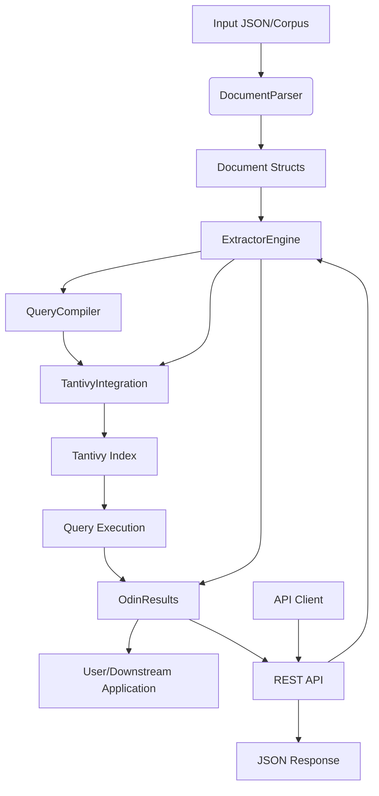

<p align="center">
  
</p>

# RustIE: Information Extraction System

> ⚠️ **Disclaimer**  
> RustIE is currently in **active development**. It is **not ready for production use** and APIs may change without notice.


RustIE is a modular information extraction (IE) system built on top of the Tantivy search engine. It is designed for efficient linguistic search and pattern-based extraction over annotated text corpora. Inspired by Odinson, RustIE supports efficient pattern-based querying over linguistically annotated text corpora.

## Quick Start

### Running the API Server

```bash
# Start the API server
cargo run --bin api_server

# With custom configuration
cargo run --bin api_server -- --host 0.0.0.0 --port 8080 --index-path ./index
```

### Querying Documents

```bash
# Health check
curl http://localhost:8080/api/v1/health

# Query documents
curl -X POST http://localhost:8080/api/v1/query \
  -H "Content-Type: application/json" \
  -d '{"query": "[word=John] >nsubj [pos=VBZ]", "limit": 10}'

# Simple query
curl "http://localhost:8080/api/v1/query/[word=John]%20%3Ensubj%20[pos=VBZ]"
```

For detailed API documentation, see [API_README.md](API_README.md).

## Architecture Overview

### Main Modules

- **data**: Handles data ingestion and structuring. Parses JSON into Rust structs and provides accessors for fields and dependencies.
- **compiler**: Compiles extraction patterns into query objects. Converts user queries into Tantivy-compatible queries.
- **digraph**: Handles dependency graphs and graph traversal for linguistic structures.
- **engine**: Orchestrates the extraction process. Main entry point for indexing, querying, and extraction.
- **tantivy_integration**: Bridges RustIE's data model and query logic with Tantivy's search engine. Implements advanced search logic.
- **results**: Structures and formats extraction results.
- **types**: Shared types and utilities used throughout the system.
- **api**: REST API for querying documents using Odinson patterns.
- **bin**: Example binaries for parsing data and running queries.

---

## How the Modules Connect



### Step-by-step:
1. **Data Ingestion:**  
   `DocumentParser` (in `data`) reads and parses annotated JSON into `Document` structs.
2. **Indexing:**  
   `ExtractorEngine` (in `engine`) converts documents into Tantivy documents and indexes them.
3. **Pattern Compilation:**  
   User queries/patterns are parsed and compiled by `QueryCompiler` (in `compiler`) into query objects.
4. **Query Execution:**  
   `ExtractorEngine` uses `tantivy_integration` to run compiled queries against the Tantivy index. Custom queries (e.g., for dependency graphs) are handled by specialized modules in `tantivy_integration` and `digraph`.
5. **Result Formatting:**  
   Matches are collected and formatted as `OdinResults` (in `results`), which are returned to the user or downstream applications.
6. **API Access:**  
   The REST API (in `api`) provides HTTP endpoints for querying documents and retrieving results.

---

## Example: End-to-End Flow

1. **User provides a JSON file** with annotated sentences and dependencies.
2. **`DocumentParser`** parses the file into Rust structs.
3. **`ExtractorEngine`** indexes the data using Tantivy.
4. **User submits a pattern/query** (e.g., `[word=John] [pos=NNP]`) via API or direct call.
5. **`QueryCompiler`** compiles the pattern into a Tantivy query.
6. **`ExtractorEngine`** executes the query, using custom logic for linguistic structures.
7. **Results** are returned as structured matches (`OdinResults`) or JSON via API.

---

## API Endpoints

- `GET /api/v1/health` - Health check
- `POST /api/v1/query` - Query documents with JSON body
- `GET /api/v1/query/{query}` - Simple query via URL parameter
- `GET /api/v1/stats` - Index statistics

See [API_README.md](API_README.md) for detailed documentation.

---

## Extending the System

- **Add new field types:** Update `Document`/`Field` and the schema.
- **Add new query types:** Extend `compiler` and `tantivy_integration`.
- **Add new extraction logic:** Implement in `engine` or as new modules.
- **Add new API endpoints:** Extend the `api` module. 